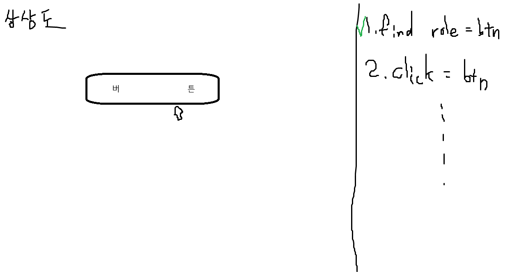

# React + TS + Vite

세상 좋아졌다. Vercel 쓰니까 공짜로 배포해주네.

## 뭘 하나요?

1년 채웠겠다. 개인 프로젝트를 해야겠다는 위기감이 들어서 만든 repository.
목표는 특정 동작 테스트?를 만들 수 있는 라이브러리를 만드는 것이다.

### 어떻게 개발하나요.

사용자가 이런 버튼을 만들면 실제 페이지 / 컴포넌트에 이런 버튼이 있는 지 체크해주는 능력을 주고 싶음.
Playwright test를 만들어주는 ui를 만드는 느낌.

비개발자도 테스트를 손쉽게 만들 수 있도록 하면 기획하면서 테스트도 만들고 TDD도 쉽게 되지 않을까?
그리고 내가 귀찮게 e2e 테스트를 만들지 않아도 됨.

- [ ] : 특정 URL에 접근해 특정 html 요소를 찾을 수 있다.
- [ ] : 프로그램이 테스트할 특정 URL을 세팅할 수 있다. (localhost만)
- [ ] : 특정 html 요소를 찾도록 할 수 있다.
- [ ] : 특정 행동을 하도록 할 수 있다. (ex: 버튼 클릭, 드래그 등...)
- [ ] : 위 행동을 연속적으로 시킬 수 있다.
- [ ] : 특정 행동 후 변경되는 ui를 찾게 할 수 있다.
- [ ] : html 요소의 세부사항이 일치하는 지 검사할 수 있다.
- [ ] : 만든 테스트를 저장 가능.

### 업데이트

- Playwright에 이미 codegen 기능이 있어서 이걸 활용할 수 있을듯.
- 일단 private 킵하기